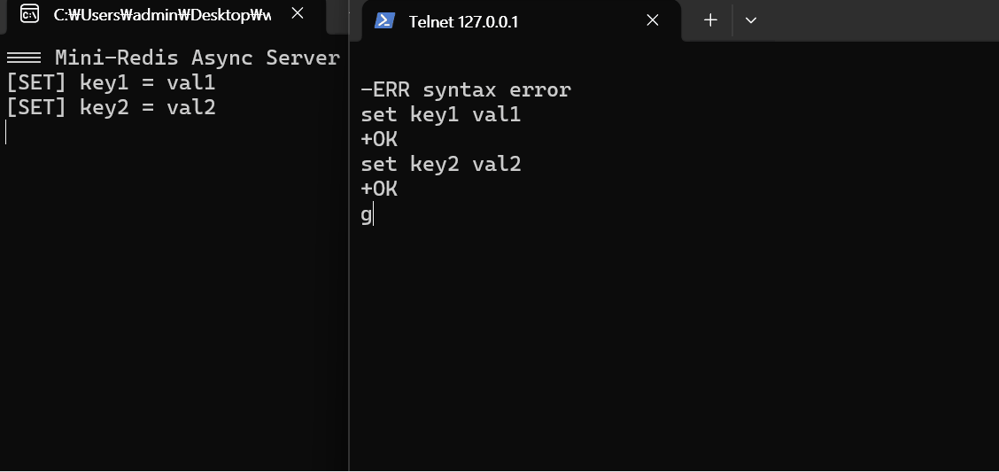
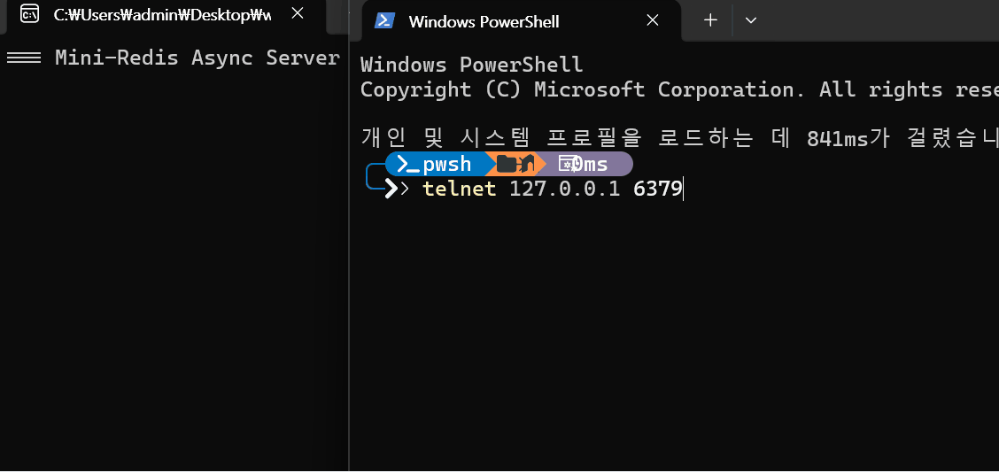
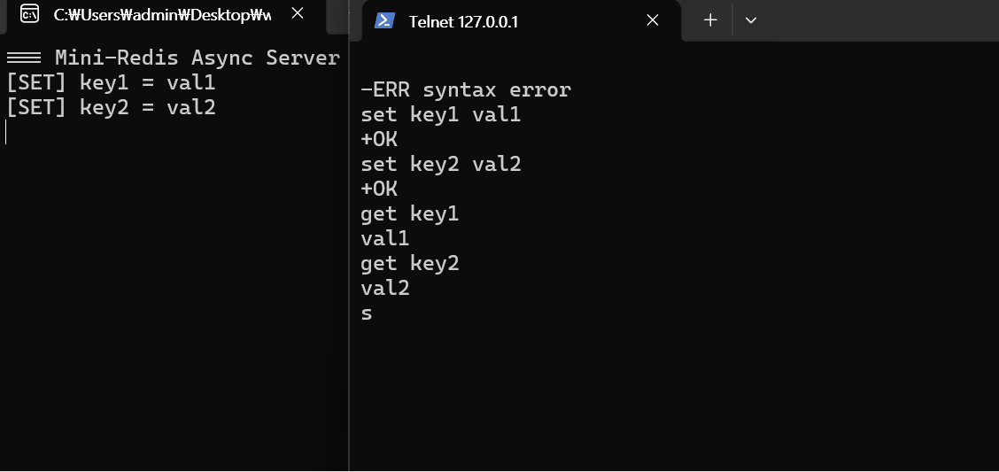
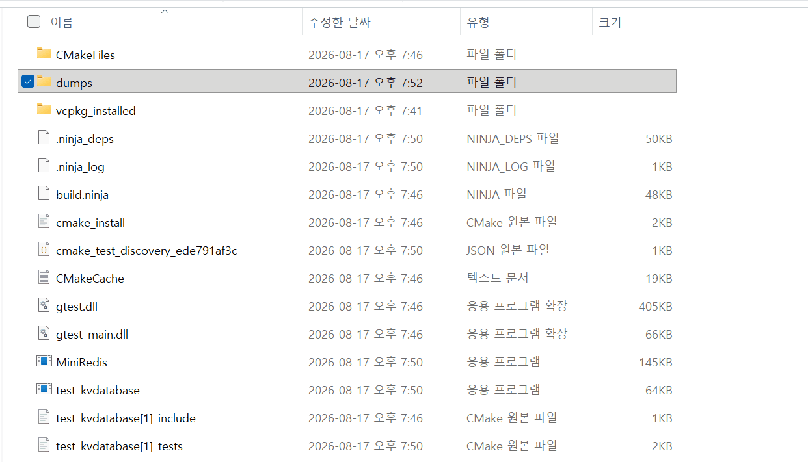

# Mini-Redis

In-Memory Key-Value Storage 만들기 </br>

## 프로젝트 개요
- **개발 기간**: 2026.08.13 ~ 2026.08.17
- **참여 인원**: 1인(개인 프로젝트), Gemini
- **목표**
	1. 반디소프트 취업
	2. 기존 Java 생태계를 C++ 메모리 관리, 멀티 스레딩, 비동기 IO 등을 이해하기 위함
	3. 웹 개발 및 업무 자동화에서는 컴퓨터과학 지식의 필요성을 크게 못 느낀 아쉬움 해소
- **기술 스택**
	- **IDE**: Visual Studio 2026 Community	
	- **Language:** C++20 (Compiler: MSVC)
	- **Network:** Boost.Asio
	- **Build & CI/CD:**: CMake, Docker, GitHub Actions
	- **Testing:** Google Test(GTest), AddressSanitizer(ASan)

## 실행 화면(Demo)
|get|set|
|:--:|:--:|
|||

|save|저장 파일 확인|
|:--:|:--:|
|||

## 프로젝트 실행 방법
### Local

> **전제조건:** Visual Studio 2026, [vcpkg](https://vcpkg.io), CMake 3.20+ 설치 필요

1. configure: `cmake -B build -S . -G "Ninja" -DCMAKE_BUILD_TYPE=Release -DCMAKE_TOOLCHAIN_FILE="$env:VCPKG_ROOT/scripts/buildsystems/vcpkg.cmake"`
2. build: `cmake --build build --config Release`
3. run: `.\build\mini-redis.exe`

### Docker
1. 도커 이미지 빌드: `docker build -t my-redis:1.0 .`
2. 도커 컨테이너 실행: `docker run -d -p 6379:6379 --name mini-redis my-redis:1.0`

## 지원 명령어
|카테고리|커맨드|
|:--|:--|
|String|`SET <key> <value>`|
|String|`GET <key>`|
|Persistence|`SAVE`|


## 단계별 구현과 학습

### 단계별 구현
- [x] C++, .clang-format, .clang-tidy, .editorconfig 등
- [x] 1단계: 자료구조 및 스레드 안정성
- [x] 2단계: Boost.Asio 네트워크 계층 연동
- [x] 3단계: Github Action CI (Linux 환경 자동 빌드, GTest, ASan 메모리 검증) 
- [x] 4단계: 💾 디스크 백업 기능
- [x] 5단계: 🐋 도커라이징


### 학습

#### C++
<details>
<summary><b><code>db_</code>, <code>socket_</code> 멤버 변수 네이밍 컨벤션</b></summary>

C++에서 매개변수와 클래스 멤버 변수를 구분하기 위한 표준적인 표기 관례입니다.

* **앞쪽 밑줄(`_db`, `__db`)을 쓰지 않는 이유:** C++ 컴파일러나 표준 라이브러리 내부 예약어로 쓰일 수 있어 충돌 위험이 있습니다.
* **뒤쪽 밑줄(`db_`)의 장점:** 컴파일러 예약어와의 충돌을 방지하며, 생성자 초기화 리스트(`db_(db)`)에서 매개변수와 멤버 변수를 직관적으로 구분할 수 있습니다.
* **Java와의 비교:** Java에서는 `this.db = db;`처럼 `this` 키워드로 변수 충돌을 해결합니다.

</details>

<details>
<summary><b> C++ 람다 표현식 (Lambda Expression)</b></summary>

`[capture] (parameters) -> return_type { statement }`

람다 외부의 변수를 함수 내부로 끌어와 사용하기 위해 `[]`(캡처 절)를 사용합니다.

* `[&]`: 외부의 모든 변수를 **참조(Reference)**로 가져옵니다.
* `[=]`: 외부의 모든 변수를 **값(Value 복사)**으로 가져옵니다.
* `[this]`: 현재 클래스 인스턴스의 포인터를 캡처하여 클래스 멤버(`db_`, `do_accept()`)에 접근합니다.
* `[=, &x, &y]`: 기본은 값 복사로 가져오되, `x`와 `y`만 참조로 가져옵니다.
* `[x, &y]`: 지정한 변수만 각각 값과 참조로 선별하여 가져옵니다.

> **참고자료:** [ModooCode - C++ 람다(Lambda) 함수](https://modoocode.com/196)

</details>

<details>
	<summary> <b>RAII(Resource Acquisition Is Initialization)와 스마트 포인터</b> </summary>

Java와 달리 C++은 GC가 없으므로 직접 메모리 관리를 해야한다. 힙 메모리에 만든 데이터를 안 지우면 메모리 누수가 발생할 수 있다.
위처럼 매번 메모리 해제를 하는 것이 실수할 가능성이 있으므로 자동으로 지워지는 Stack의 특성을 이용해서 Heap 메모리를 관리하고자 했다.
이에 등장한 것이 RAII이다.

Stack에 관리자 객체를 하나 두고 데이터 자체는 힙에 둔다.
필요가 없어지면서 스택에 있던 관리자 객체가 사라진다.
사라지기 직전 소멸자에서 리소스를 해제한다.

스마트 포인터(MS 문서에 적혀있는 코드)
```c++
	void UseRawPointer()
	{
		// Using a raw pointer -- not recommended.
		Song* pSong = new Song(L"Nothing on You", L"Bruno Mars"); 

		// Use pSong...

		// Don't forget to delete!
		delete pSong;   
	}

	void UseSmartPointer()
	{
		// Declare a smart pointer on stack and pass it the raw pointer.
		unique_ptr<Song> song2(new Song(L"Nothing on You", L"Bruno Mars"));

		// Use song2...
		wstring s = song2->duration_;
		//...

	} // song2 is deleted automatically here.
```


> **참고자료**
- https://learn.microsoft.com/ko-kr/cpp/cpp/object-lifetime-and-resource-management-modern-cpp?view=msvc-170
- https://learn.microsoft.com/ko-kr/cpp/cpp/smart-pointers-modern-cpp?view=msvc-170
</details>


<details>
	<summary> <b><code>std::move</code> 이동 시맨틱과 소유권 이전</b> </summary>

* `a = b;`라고 수행하면 a 전체를 복사해서 b에 넣으므로 시간이 오래걸릴 수 있다.
* 그런데 a는 더이상 쓰지 않으면 복사를 수행할 필요가 없이 알맹이만 빼서 이동시키는 것이 효율적이다.
* 이것이 '이동'이다.

> **참고자료:** [ModooCode - C++](https://modoocode.com/301)
</details>


## 참고자료
- https://build-your-own.org/redis/

